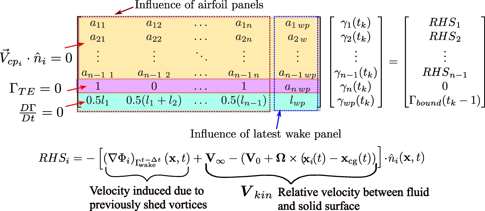

# Summary
Analyzing the aerodynamics of unsteady airfoils is essential for understanding the performance of wind turbine blades, helicopter rotors, and the flight dynamics of birds, insects, fixed-wing aircraft, and micro air vehicles (MAVs). While computational fluid dynamics (CFD) offers detailed and high-fidelity results, potential flow solvers provide a faster and more accessible alternative that still captures key aerodynamic phenomena. These include time-resolved pressure distribution, unsteady lift generation, thrust prediction, power consumption analysis, and estimation of propulsive efficiency. The use of free-wake modeling further enables these solvers to capture critical unsteady effects such as vortex shedding and wake-induced flow interactions.

We introduce PANKH **(Panel Analysis of uNsteady Kinematics of Hovering airfoils)**, an open-source C++ tool that employs the unsteady vortex panel method to evaluate aerodynamic forces on airfoils in arbitrary motion. Its flexible, modular design enables users to specify custom kinematic patterns (impulsive motion, pitching, plunging), ideal for exploring bio-inspired flapping flight and gust responses.

The solver’s source code, validation examples, and comprehensive Doxygen-generated API documentation are hosted on GitHub, ensuring accessibility and reproducibility. Future enhancements may include expanded input capabilities, improved wake modeling techniques for more accurate unsteady flow prediction, and the integration of viscous effects along with two-way fluid–structure interaction (FSI) to simulate flexible airfoils and their coupling with the flow in a strongly coupled manner.

# Statement of Need

For low-speed aerodynamic applications, where viscous effects are predominantly confined to thin boundary layers and wakes, potential flow solvers offer a computationally and time saving efficient alternative to high-fidelity computational fluid dynamics (CFD) and experimental approaches. High-fidelity CFD simulations, executed on high-performance computing (HPC) clusters comprising multiple nodes and cores, often demand days of runtime due to their intensive computational requirements and parallel processing across distributed architectures. Experimental aerodynamic investigations, on the other hand, involve considerable capital investment and extended timelines. Designing wind/water tunnel setups, procuring flow visualization tools, and conducting controlled tests may take several months to years. Moreover, accommodating different flow conditions often requires substantial modifications to the experimental apparatus. To mitigate these limitations, scaling laws and dimensional analysis are commonly used but come with their own assumptions and constraints. In contrast, PANKH is a modular and open-source aerodynamic solver written in C++. It is designed to offer a rapid and accessible alternative for potential flow analysis in low-speed aerodynamic applications. Although still in its early development stage, PANKH is capable of delivering accurate estimates of aerodynamic loads within minutes. It runs efficiently even on standard single-core desktop systems. Future enhancements of the software will include parallelization via OpenMP or MPI, significantly improving performance for large-scale unsteady simulations. Additionally, the planned development of a graphical user interface (GUI) will streamline usability across platforms, including Android-based systems, transforming PANKH into a portable and interactive educational tool for both undergraduate and graduate-level aerodynamics courses.

Low-to-medium fidelity solvers like PANKH solve Laplace’s equation to model inviscid, incompressible, and irrotational flows, minimizing computational complexity while delivering precise lift estimations for aerodynamic analysis. By solving Laplace’s equation with appropriate boundary conditions, PANKH enable rapid aerodynamic analysis, making them particularly useful for preliminary design, scaling studies, and parametric investigations. Despite their advantages, open-source tools for unsteady potential flow analysis remain scarce. Established tools such as [XFOIL](https://web.mit.edu/drela/Public/web/xfoil/) [@drela1989xfoil], NASA's FoilSIM III, JavaFoil are tailored for steady-state aerodynamics and lack the capability to address unsteady flow phenomena. Existing research codes for unsteady vortex panel methods are often proprietary, poorly documented, or no longer maintained. In contrast, PANKH is purpose-built for the unsteady aerodynamics of hovering airfoils, offering advanced features tailored for applications such as fixed-wing aircraft, flapping-wing micro-air vehicles (MAVs), ornithopters, and hovering rotorcraft. The software repository includes  validation cases comparing PANKH's results with experimental studies by [@anderson1998oscillating] and [@floryan2017scaling], as well as with numerical simulations reported by [@dimitri]. For three-dimensional wing design, understanding two-dimensional cross-sectional properties through airfoil analysis is critical for selecting optimal shapes. 

PANKH shows strong potential for real-world applications across research, education, and hobbyist domains. In the aviation industry, it can be integrated with structural solvers to perform coupled fluid–structure interaction analyses, aiding the design of flexible lifting surfaces. Its modular and procedural backend makes it suitable for classroom use, allowing students to simulate and visualize various unsteady flow scenarios with ease. PANKH can also support hobbyists and independent experimentalists working on flapping-wing vehicles, to estimate aerodynamic forces on key sections—supporting early design decisions and material selection.

# Methodology

### Governing Equation and Boundary Conditions
The numerical framework solves Laplace’s equation, $\nabla^2\Phi=0$, using appropriate boundary conditions. These include the no-penetration boundary condition and the far-field boundary condition. The latter is inherently satisfied by the elementary solutions of the Laplace equation.
In this solver, we employ the Neumann condition, meaning that the problem is formulated in terms of velocity rather than directly solving for $\Phi$. The velocity field is then expressed in terms of singularity distributions placed along the airfoil surface.

### Discretization of Geometry and Singularity Element Distribution

The airfoil is discretized into n nodes (panel vertices), forming n-1 flat panels. Each panel has a control point at its midpoint where the no-penetration condition is enforced:
$$
[(\boldsymbol{V}_{bound}+ \boldsymbol{V}_{wake}+\boldsymbol{V}_{kin})_i\cdot\hat{\boldsymbol{n}}_i]_{t_k}=0\,,(1 \leq i \leq n-1)
$$
The total number of unknowns in the system is $n+1$:
 1) $n$ bound vortex strengths $\gamma_i\,(1 \leq i \leq n)$ on the airfoil.
 2) $\gamma_{wp}$, the strength of the latest shed wake panel. For additional methodological details, refer to [@vezza1985method] and [@basu_1978].
 
As illustrated in **Figure 1**, the solver employs a *piecewise linearly varying vortex distribution* on the airfoil surface, while in the wake, a constant-strength vortex panel is shed from the trailing edge at each time step. These wake vortices are then convected with the local velocity field and influence the induced velocity at subsequent time steps.

### Other Physical Considerations

#### Trailing Edge Condition(Kutta Condition)
Satisfying the boundary conditions alone do not yield a unique solution for $\gamma_i\,(1 \leq i \leq n)$. To obtain an unique solution, the flow must leave the airfoil's sharp trailing edge smoothly along the bisector line, which is the well known ***Kutta Condition*** [@eldredge2019mathematical].
$$
\Gamma_{\text{TE}}(t_k)=0
$$
$$
\gamma_1(t_k)+\gamma_n(t_k)+\gamma_{wp}(t_k)=0
$$
#### Kelvin’s Circulation Theorem
For unsteady flows, the motion of the airfoil causes wake formation. The reason for wake formation can be explained by surrounding the airfoil by a sufficiently large contour, and noting that only conservative forces, such are pressure act on the contour [@katz2001low]. Then Kelvin’s theorem states that the total circulation in the contour remains constant, i.e., 

$$
\frac{\mathrm{D}\Gamma}{\mathrm{D}t}= \frac{\mathrm{D}}{\mathrm{D}t}\left(\Gamma_{\text{airfoil}}+\Gamma_{\text{wake}}\right)=0
$$

The resulting system, formulated as shown in **Figure 2**, is expressed as a single matrix equation and solved using the QR decomposition method, specifically the *ColPivHouseholderQR* class from the *Eigen library*, [@eigenweb].

### Wake Modeling

PANKH utilizes a robust time-stepping wake model to capture the intricate dynamics of vortex shedding, which is a critical aspect of unsteady aerodynamics. Shed vortices convect, interact, and induce velocities on both the airfoil and neighboring wake elements, significantly influencing the pressure distribution and resulting aerodynamic loads. While some existing methods, such as the one used in ULVPC  [@prosser2011applicability], model the most recently shed vortex as a point vortex for simplicity, this approximation may limit the physical fidelity of wake dynamics. In contrast, PANKH adopts the vortex panel-based approach of [@basu_1978]. In this approach, the newly shed wake vortex is modeled as a constant-strength vortex panel whose strength, orientation, and length are not known a priori. This leads to a nonlinear system of equations, which is solved iteratively using Newton’s method.

The entire numerical framework discussed above is implemented in the code. The implementation is structured into separate .cpp files, each containing functions dedicated to specific numerical tasks. The function and variable names are chosen to align with their respective roles in the numerical framework, ensuring clarity and ease of use for the user. A detailed guide on input paramters, motion specification, and output interpretation is provided in the project's [README](https://github.com/coding4Acause/2d_UnsteadyVortexPanel/blob/main/README.md). An extensive testing and validation suite has been used to ensure the accuracy of the results obtained from the source code.

# Acknowledgements
This work was supported by ABC Transformers Pvt. Ltd. under grant no. C/ABC/NPA/20220065

# References